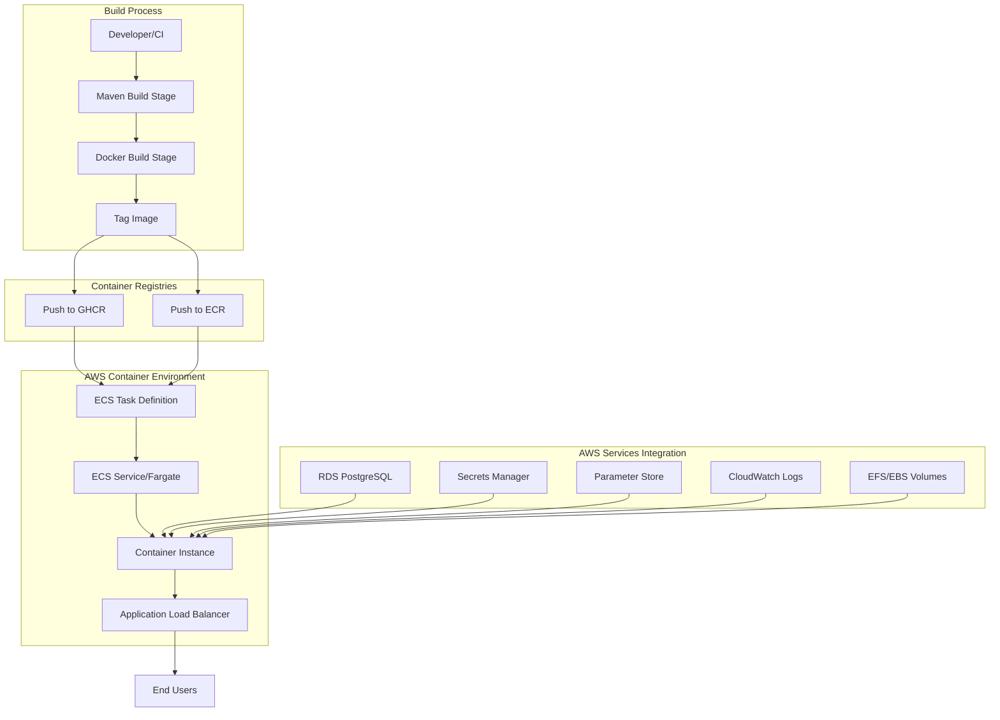
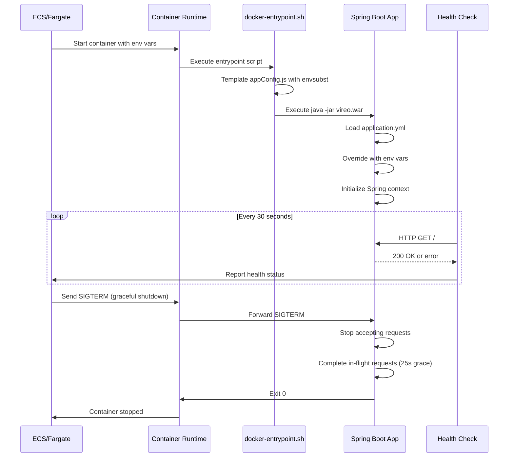

# Design Document: JHU Docker Image for AWS

## Overview

This design specifies the technical implementation for creating a production-ready Docker image of the Vireo ETD Management System optimized for Johns Hopkins University (JHU) deployment in AWS container orchestration environments. The solution replaces the current SSH-based deployment workflow with a containerized approach that leverages AWS ECS/Fargate, ECR, and related services.

### Goals

- Create a JHU-specific Dockerfile (`Dockerfile.jhu`) optimized for AWS container services
- Enable configuration through environment variables for AWS Secrets Manager and Parameter Store integration
- Implement container health checks for orchestration platform compatibility
- Support external volume mounts for persistent data (EFS or EBS)
- Support manual or automated image builds and pushes to GHCR and ECR
- Maintain compatibility with existing Spring Boot 2.x and Java 11 runtime
- Support both local development and production deployment scenarios
- Ensure security best practices (non-root user, no hardcoded secrets, proper SHA labeling)

### Non-Goals

- Modifying the base Dockerfile (it remains for local development)
- Changing the application's core configuration structure
- Implementing Kubernetes-specific features (focus is ECS/Fargate)
- Creating a complete infrastructure-as-code solution (only Docker image and CI/CD)

## Architecture

### High-Level Architecture



### Container Lifecycle



### Deployment Flow

The deployment process follows these stages:

1. **Build Stage**: Maven builds WAR with production profile
2. **Docker Stage**: Multi-stage Dockerfile creates optimized JRE image with proper labels
3. **Registry Stage**: Image tagged and pushed to GHCR or ECR manually or via CI/CD
4. **Deployment Stage**: ECS pulls image from GHCR or ECR and creates task instances
5. **Runtime Stage**: Container starts with environment-specific configuration from Secrets Manager/Parameter Store

## Components and Interfaces

### 1. Dockerfile.jhu

**Purpose**: JHU-specific multi-stage Dockerfile optimized for AWS deployment

**Structure**:
- **Maven Stage**: Builds application WAR with production profile
- **JRE Stage**: Creates minimal runtime image with Java 11 JRE

**Key Differences from Base Dockerfile**:
- Adds HEALTHCHECK instruction for ECS compatibility
- Configures graceful shutdown timeout (30s)
- Optimizes layer caching for faster builds
- Includes AWS-specific labels (version, commit SHA, build timestamp)

**Build Arguments**:
```dockerfile
ARG USER_ID=1000
ARG USER_NAME=vireo
ARG HOME_DIR=/vireo
ARG SOURCE_DIR=$HOME_DIR/source
ARG APP_PATH=/var/vireo
ARG NODE_ENV=production
```

**Health Check Configuration**:
```dockerfile
HEALTHCHECK --interval=30s --timeout=10s --start-period=60s --retries=3 \
  CMD wget --no-verbose --tries=1 --spider http://localhost:9000/ || exit 1
```

### 2. Enhanced docker-entrypoint.sh

**Purpose**: Initialize container environment and template configuration files

**Responsibilities**:
- Template `appConfig.js` using environment variables
- Validate required environment variables are present
- Set up logging to STDOUT/STDERR for CloudWatch
- Handle graceful shutdown signals

**Key Environment Variables Processed**:
- `AUTH_SERVICE_URL`: Authentication service endpoint
- `LOCAL_AUTHENTICATION`: Enable/disable local auth (true/false/'alternate')
- `STOMP_DEBUG`: WebSocket debugging flag (true/false)
- `APP_PATH`: Application data directory path

**Error Handling**:
- Exit with code 1 if required variables missing
- Log descriptive error messages to STDERR
- Validate template file exists before processing

### 3. Spring Boot Configuration Override

**Purpose**: Enable environment variable-based configuration for AWS deployment

**Configuration Hierarchy** (highest to lowest precedence):
1. Environment variables (AWS Secrets Manager, ECS task definition)
2. External `application.yml` (mounted volume)
3. Packaged `application.yml` (WAR file)

**Key Environment Variable Mappings**:

| Environment Variable | Spring Property | Purpose |
|---------------------|-----------------|---------|
| `SPRING_DATASOURCE_URL` | `spring.datasource.url` | RDS connection string |
| `SPRING_DATASOURCE_USERNAME` | `spring.datasource.username` | Database username |
| `SPRING_DATASOURCE_PASSWORD` | `spring.datasource.password` | Database password |
| `SPRING_JPA_DATABASE_PLATFORM` | `spring.jpa.database-platform` | Hibernate dialect |
| `AUTH_SECURITY_JWT_SECRET` | `auth.security.jwt.secret` | JWT signing key |
| `APP_SECURITY_SECRET` | `app.security.secret` | Crypto service key |
| `APP_EMAIL_HOST` | `app.email.host` | SMTP server |
| `APP_EMAIL_FROM` | `app.email.from` | Email sender address |
| `SERVER_PORT` | `server.port` | HTTP port (default 9000) |
| `LOGGING_LEVEL_ORG_TDL` | `logging.level.org.tdl` | Application log level |

**Spring Boot Auto-Configuration**:
Spring Boot automatically converts environment variables with underscores to property paths with dots and lowercase. For example:
- `SPRING_DATASOURCE_URL` → `spring.datasource.url`
- `AUTH_SECURITY_JWT_SECRET` → `auth.security.jwt.secret`

### 4. Image Tagging and Registry Support

**Purpose**: Support pushing Docker images to GHCR and ECR with consistent tagging

**Image Tagging Strategy**:
- `ghcr.io/{org}/{repo}:latest` - Most recent build (GHCR format)
- `ghcr.io/{org}/{repo}:jhu-aws-{version}` - Semantic version from pom.xml (e.g., `jhu-aws-4.3.2`)
- `ghcr.io/{org}/{repo}:jhu-aws-{short-sha}` - 12-character short Git commit SHA for traceability
- `ghcr.io/{org}/{repo}:jhu-aws-{timestamp}` - Build timestamp (YYYYMMDD-HHMMSS)
- `{account}.dkr.ecr.{region}.amazonaws.com/{repo}:*` - Same tags for ECR format

**Short SHA Format**:
- Use first 12 characters of Git commit SHA in image tags
- Example: Full SHA `a1b2c3d4e5f6g7h8i9j0k1l2m3n4o5p6q7r8s9t0` → Short SHA `a1b2c3d4e5f6`
- Short SHAs provide sufficient uniqueness while keeping tags readable

**Registry Support**:
- **GitHub Container Registry (GHCR)**: `ghcr.io` - Public or private container registry
- **Amazon Elastic Container Registry (ECR)**: `{account}.dkr.ecr.{region}.amazonaws.com` - AWS-native registry

**Manual Push Commands**:

```bash
# Build image with proper tags
docker build -f Dockerfile.jhu \
  --build-arg VERSION=4.3.2 \
  --build-arg VIREO_GIT_SHA_FULL=$(git rev-parse HEAD) \
  --build-arg VIREO_GIT_SHA_SHORT=$(git rev-parse --short=12 HEAD) \
  --build-arg BUILD_TIMESTAMP=$(date +%Y%m%d-%H%M%S) \
  -t ghcr.io/jhu-sheridan-libraries/vireo:latest \
  -t ghcr.io/jhu-sheridan-libraries/vireo:jhu-aws-4.3.2 \
  -t ghcr.io/jhu-sheridan-libraries/vireo:jhu-aws-$(git rev-parse --short=12 HEAD) \
  .

# Push to GHCR (requires authentication)
docker login ghcr.io
docker push ghcr.io/jhu-sheridan-libraries/vireo:latest
docker push ghcr.io/jhu-sheridan-libraries/vireo:jhu-aws-4.3.2
docker push ghcr.io/jhu-sheridan-libraries/vireo:jhu-aws-$(git rev-parse --short=12 HEAD)

# Push to ECR (requires AWS authentication)
aws ecr get-login-password --region us-east-1 | docker login --username AWS --password-stdin {account}.dkr.ecr.us-east-1.amazonaws.com
docker tag ghcr.io/jhu-sheridan-libraries/vireo:latest {account}.dkr.ecr.us-east-1.amazonaws.com/vireo:latest
docker push {account}.dkr.ecr.us-east-1.amazonaws.com/vireo:latest
```

### 5. ECS Task Definition Template

**Purpose**: Reference template for deploying container in ECS

**Key Configuration Elements**:

```json
{
  "family": "vireo-jhu-aws",
  "networkMode": "awsvpc",
  "requiresCompatibilities": ["FARGATE"],
  "cpu": "1024",
  "memory": "2048",
  "containerDefinitions": [{
    "name": "vireo",
    "image": "ghcr.io/jhu-sheridan-libraries/vireo:jhu-aws-{version}",
    "portMappings": [{
      "containerPort": 9000,
      "protocol": "tcp"
    }],
    "environment": [
      {"name": "APP_PATH", "value": "/var/vireo"},
      {"name": "AUTH_SERVICE_URL", "value": "window.location.protocol + '//' + window.location.host + window.location.base"},
      {"name": "LOCAL_AUTHENTICATION", "value": "false"},
      {"name": "STOMP_DEBUG", "value": "false"}
    ],
    "secrets": [
      {"name": "SPRING_DATASOURCE_URL", "valueFrom": "arn:aws:secretsmanager:region:account:secret:name"},
      {"name": "SPRING_DATASOURCE_USERNAME", "valueFrom": "arn:aws:secretsmanager:region:account:secret:name"},
      {"name": "SPRING_DATASOURCE_PASSWORD", "valueFrom": "arn:aws:secretsmanager:region:account:secret:name"},
      {"name": "AUTH_SECURITY_JWT_SECRET", "valueFrom": "arn:aws:secretsmanager:region:account:secret:name"},
      {"name": "APP_SECURITY_SECRET", "valueFrom": "arn:aws:secretsmanager:region:account:secret:name"}
    ],
    "mountPoints": [{
      "sourceVolume": "vireo-data",
      "containerPath": "/var/vireo"
    }],
    "logConfiguration": {
      "logDriver": "awslogs",
      "options": {
        "awslogs-group": "/ecs/vireo-jhu-aws",
        "awslogs-region": "us-east-1",
        "awslogs-stream-prefix": "vireo"
      }
    },
    "healthCheck": {
      "command": ["CMD-SHELL", "wget --no-verbose --tries=1 --spider http://localhost:9000/ || exit 1"],
      "interval": 30,
      "timeout": 10,
      "retries": 3,
      "startPeriod": 60
    },
    "stopTimeout": 30
  }],
  "volumes": [{
    "name": "vireo-data",
    "efsVolumeConfiguration": {
      "fileSystemId": "fs-xxxxxxxx",
      "transitEncryption": "ENABLED"
    }
  }]
}
```

**Secrets Management Options**:

The ECS task definition supports loading secrets from two AWS services:

1. **AWS Secrets Manager** (Recommended for sensitive data):
   ```json
   {"name": "SPRING_DATASOURCE_PASSWORD", "valueFrom": "arn:aws:secretsmanager:us-east-1:123456789012:secret:vireo/db-password-AbCdEf"}
   ```

2. **AWS Systems Manager Parameter Store** (For configuration parameters):
   ```json
   {"name": "SPRING_DATASOURCE_URL", "valueFrom": "arn:aws:ssm:us-east-1:123456789012:parameter/vireo/db-url"}
   ```

**Choosing Between Secrets Manager and Parameter Store**:
- **Secrets Manager**: Use for passwords, API keys, database credentials (automatic rotation, encryption at rest)
- **Parameter Store**: Use for configuration values, connection strings, non-sensitive settings (simpler, lower cost)
- Both integrate seamlessly with ECS task definitions via the `secrets` field

**Resource Allocation**:
- **CPU**: 1 vCPU (1024 units) - sufficient for moderate load
- **Memory**: 2 GB - accommodates JVM heap and Spring Boot overhead
- **Scaling**: Horizontal scaling via ECS service auto-scaling

### 6. Volume Mount Strategy

**Purpose**: Persist application data across container restarts

**Volume Types**:

1. **Amazon EFS (Recommended for Multi-AZ)**:
   - Shared filesystem across multiple containers
   - Automatic backups and encryption
   - Mount at `/var/vireo` for application data
   - Mount at `/vireo/logs` for application logs (optional if using CloudWatch)

2. **Amazon EBS (Single-AZ deployments)**:
   - Block storage attached to single EC2 instance
   - Higher performance than EFS
   - Requires manual backup configuration

**Directory Structure**:
```
/var/vireo/
├── public/          # Public assets (uploaded files)
├── private/         # Private documents (submissions)
├── config/          # External configuration files (optional)
└── appConfig.js     # Templated frontend configuration
```

**Permissions**:
- Container runs as UID 1000 (non-root user `vireo`)
- EFS/EBS must allow read/write for UID 1000
- Use EFS access points to enforce permissions

### 7. Local Development vs Production Deployment

**Purpose**: Support both local development and production deployment scenarios with the same Docker image

**Local Development Configuration**:

```bash
# Local development with docker-compose
docker-compose -f docker-compose-test.yml up

# Local development with docker run
docker run -p 9000:9000 \
  -e SPRING_DATASOURCE_URL=jdbc:postgresql://localhost:5432/vireo \
  -e SPRING_DATASOURCE_USERNAME=vireo \
  -e SPRING_DATASOURCE_PASSWORD=vireo \
  -e AUTH_SECURITY_JWT_SECRET=local-dev-secret \
  -e APP_SECURITY_SECRET=local-dev-secret \
  -e LOCAL_AUTHENTICATION=true \
  -v $(pwd)/data:/var/vireo \
  ghcr.io/jhu-sheridan-libraries/vireo:jhu-aws-latest
```

**Local Development Features**:
- Use H2 or local PostgreSQL database
- Mount local directories for live code/data changes
- Enable local authentication (no Shibboleth)
- Use simple secrets (not from AWS)
- Expose port 9000 directly to host
- Enable debug logging

**Production Deployment Configuration**:

```bash
# Production deployment via ECS task definition
# Secrets loaded from AWS Secrets Manager/Parameter Store
# No direct port exposure (behind ALB)
# Logging to CloudWatch
# EFS volumes for persistent data
```

**Production Features**:
- Use AWS RDS PostgreSQL database
- Load secrets from AWS Secrets Manager/Parameter Store
- Disable local authentication (use Shibboleth)
- Behind Application Load Balancer
- CloudWatch Logs integration
- EFS volumes for shared storage
- Auto-scaling and health checks

**Key Differences**:

| Aspect | Local Development | Production |
|--------|------------------|------------|
| Database | H2 or local PostgreSQL | AWS RDS PostgreSQL |
| Secrets | Environment variables | AWS Secrets Manager/Parameter Store |
| Authentication | Local auth enabled | Shibboleth (local auth disabled) |
| Port Exposure | Direct (9000) | Via ALB (80/443) |
| Logging | Console output | CloudWatch Logs |
| Storage | Local volumes | EFS/EBS volumes |
| Scaling | Single container | Auto-scaling group |
| Health Checks | Optional | Required (ECS) |

**Dockerfile Compatibility**:
- Same Dockerfile.jhu works for both scenarios
- Configuration differences handled via environment variables
- No code changes needed between environments
- Promotes dev/prod parity

## Data Models

### Environment Configuration Model

The application configuration is represented as a hierarchical model with environment variable overrides:

```yaml
# Base Configuration (application.yml)
server:
  port: 9000

spring:
  datasource:
    url: jdbc:postgresql://localhost:5432/vireo
    username: vireo
    password: vireo  # Overridden by env var
  jpa:
    database-platform: org.hibernate.dialect.PostgreSQLDialect

auth:
  security:
    jwt:
      secret: verysecretsecret  # Overridden by env var
      issuer: localhost
      duration: 5

app:
  security:
    secret: verysecretsecret  # Overridden by env var
  assets:
    uri: file:/var/vireo/
  email:
    host: relay.tamu.edu
    from: noreply@library.tamu.edu
```

**Environment Variable Override Example**:
```bash
# Production environment variables (from AWS Secrets Manager)
SPRING_DATASOURCE_URL=jdbc:postgresql://vireo-db.xxxxx.us-east-1.rds.amazonaws.com:5432/vireo
SPRING_DATASOURCE_USERNAME=vireo_prod
SPRING_DATASOURCE_PASSWORD=<secret-from-secrets-manager>
AUTH_SECURITY_JWT_SECRET=<secret-from-secrets-manager>
APP_SECURITY_SECRET=<secret-from-secrets-manager>
APP_EMAIL_HOST=email-smtp.us-east-1.amazonaws.com
```

### Frontend Configuration Model

The `appConfig.js` file is templated at container startup:

```javascript
// Template: build/appConfig.js.template
var appConfig = {
    'version': '4.3.2',
    'allowAnonymous': true,
    'anonymousRole': 'ROLE_ANONYMOUS',
    'authService': ${AUTH_SERVICE_URL},  // Substituted by envsubst
    'webService': window.location.protocol + '//' + window.location.host + window.location.base,
    'storageType': 'session',
    'stompDebug': ${STOMP_DEBUG},  // Substituted by envsubst
    'localAuthentication': ${LOCAL_AUTHENTICATION},  // Substituted by envsubst
    // ... additional configuration
};
```

**Environment Variables for Templating**:
- `AUTH_SERVICE_URL`: JavaScript expression for auth service endpoint
- `STOMP_DEBUG`: Boolean for WebSocket debugging
- `LOCAL_AUTHENTICATION`: Boolean or string 'alternate' for auth mode

### Image Metadata Model

Docker image labels provide traceability following OCI standards and JHU conventions:

```dockerfile
LABEL org.opencontainers.image.title="Vireo ETD Management System - JHU AWS"
LABEL org.opencontainers.image.description="JHU-specific Docker image for AWS ECS/Fargate deployment"
LABEL org.opencontainers.image.version="${VERSION}"
LABEL org.opencontainers.image.created="${BUILD_TIMESTAMP}"
LABEL org.opencontainers.image.revision="${VIREO_GIT_SHA_FULL}"
LABEL org.opencontainers.image.source="https://github.com/jhu-sheridan-libraries/vireo"
LABEL org.opencontainers.image.vendor="Johns Hopkins University"
LABEL edu.jhu.vireo.config-sha="${DEPLOYMENT_CONFIG_SHA_FULL}"
LABEL edu.jhu.vireo.build-label="${VIREO_GIT_SHA_SHORT}-config-${DEPLOYMENT_CONFIG_SHA_SHORT}"
```

**Label Naming Convention**:
- `org.opencontainers.image.revision`: Full Vireo application Git SHA (40 characters)
- `edu.jhu.vireo.config-sha`: Full deployment configuration Git SHA (40 characters) 
- `edu.jhu.vireo.build-label`: Combined label following format `[Vireo-Head-SHA]-config-[Deployment-Head-SHA]` using 12-character short SHAs

**Example Values**:
```
org.opencontainers.image.revision=a1b2c3d4e5f6g7h8i9j0k1l2m3n4o5p6q7r8s9t0
edu.jhu.vireo.config-sha=z9y8x7w6v5u4t3s2r1q0p9o8n7m6l5k4j3i2h1g0
edu.jhu.vireo.build-label=a1b2c3d4e5f6-config-z9y8x7w6v5u4
```


## Correctness Properties

*A property is a characteristic or behavior that should hold true across all valid executions of a system—essentially, a formal statement about what the system should do. Properties serve as the bridge between human-readable specifications and machine-verifiable correctness guarantees.*

### Property Reflection

After analyzing the acceptance criteria, I identified the following testable properties. Many criteria are specific examples (Dockerfile directives, workflow configuration) rather than universal properties. The properties below represent behaviors that should hold across multiple inputs or configurations:

**Properties Identified**:
- Environment variable override for database configuration (3 similar criteria: URL, username, password)
- Environment variable override for security secrets (2 similar criteria: JWT secret, app secret)
- Environment variable override for general configuration
- Logging to STDOUT/STDERR

**Consolidation Analysis**:
- Requirements 2.1, 6.1, 6.2, 6.3, and 6.5 all test environment variable override for database configuration - these can be combined into a single comprehensive property
- Requirements 2.2, 2.3, 7.1, and 7.2 all test environment variable override for security secrets - these can be combined
- Requirement 2.4 is a general statement that encompasses all environment variable overrides - this is the parent property
- Requirement 2.5 (logging) is distinct and remains separate

**Final Properties** (after consolidation):
1. Environment variable configuration override (general)
2. Logging output to STDOUT/STDERR

### Property 1: Environment Variable Configuration Override

*For any* Spring Boot configuration property that has a corresponding environment variable set, the application SHALL use the environment variable value instead of the default value from application.yml.

**Validates: Requirements 2.1, 2.2, 2.3, 2.4, 6.1, 6.2, 6.3, 6.5, 7.1, 7.2**

**Rationale**: Spring Boot's externalized configuration follows a precedence hierarchy where environment variables override properties files. This property ensures that all configuration can be injected at runtime via environment variables, which is essential for AWS Secrets Manager integration and container orchestration. This single property covers database configuration (datasource URL, username, password, JPA platform), security configuration (JWT secret, crypto secret), and any other Spring Boot property.

**Test Strategy**: Generate random valid configuration values for various Spring Boot properties, set them as environment variables, start the container, and verify the application uses the environment variable values rather than defaults.

### Property 2: Application Logging to Standard Streams

*For any* log message generated by the application at any log level (INFO, WARN, ERROR, DEBUG), the message SHALL be written to STDOUT (for INFO/DEBUG) or STDERR (for WARN/ERROR).

**Validates: Requirements 2.5**

**Rationale**: AWS CloudWatch Logs captures container output from STDOUT and STDERR. By ensuring all application logs go to these standard streams (rather than files), we enable seamless integration with CloudWatch without additional log forwarding agents. This property must hold for all log messages regardless of source (application code, Spring Boot, Hibernate, etc.).

**Test Strategy**: Generate log messages at various levels from different parts of the application, capture container output, and verify all messages appear on the appropriate standard stream.

## Error Handling

### Build-Time Errors

**Dockerfile Syntax Errors**:
- **Detection**: Docker build fails with syntax error message
- **Handling**: CI/CD pipeline fails, preventing image push to ECR
- **Recovery**: Developer fixes Dockerfile syntax, commits, triggers rebuild

**Maven Build Failures**:
- **Detection**: Maven exits with non-zero status during Docker build
- **Handling**: Docker build fails at Maven stage, no image created
- **Recovery**: Developer fixes Java compilation or test issues, commits, triggers rebuild
- **Common Causes**: Dependency resolution failures, compilation errors, resource processing errors

**NPM Build Failures**:
- **Detection**: NPM exits with non-zero status during Maven build
- **Handling**: Maven build fails, Docker build fails
- **Recovery**: Developer fixes frontend build issues (missing dependencies, webpack errors)
- **Common Causes**: Node version mismatch, missing node_modules, webpack configuration errors

### Runtime Errors

**Missing Required Environment Variables**:
- **Detection**: Application fails to start, logs error message to STDERR
- **Handling**: Container exits with non-zero status, ECS marks task as failed
- **Recovery**: Update ECS task definition with required environment variables, redeploy
- **Example Error**: "Required environment variable SPRING_DATASOURCE_URL not set"

**Invalid Database Connection**:
- **Detection**: Spring Boot fails to establish database connection during startup
- **Handling**: Application logs connection error, container exits with non-zero status
- **Recovery**: Verify RDS endpoint, security groups, credentials; update task definition
- **Example Error**: "Could not connect to database: Connection refused"

**Health Check Failures**:
- **Detection**: Health check command returns non-zero exit code 3 consecutive times
- **Handling**: ECS marks container unhealthy, stops and replaces it
- **Recovery**: Investigate application logs in CloudWatch, check resource constraints
- **Common Causes**: Application deadlock, out of memory, database connection pool exhaustion

**Volume Mount Permission Errors**:
- **Detection**: Application fails to write to /var/vireo, logs permission denied error
- **Handling**: Container may start but fail to persist data
- **Recovery**: Configure EFS access point with correct POSIX user (UID 1000), update task definition
- **Example Error**: "Permission denied: /var/vireo/public"

**Graceful Shutdown Timeout**:
- **Detection**: Application doesn't exit within 30 seconds of SIGTERM
- **Handling**: Docker sends SIGKILL, forcefully terminates container
- **Recovery**: Investigate why shutdown is slow (long-running requests, database transactions)
- **Mitigation**: Increase stopTimeout in task definition if legitimate long-running operations

### Configuration Errors

**Invalid Hibernate Dialect**:
- **Detection**: JPA initialization fails with unsupported dialect error
- **Handling**: Application fails to start, container exits
- **Recovery**: Set correct SPRING_JPA_DATABASE_PLATFORM for database type
- **Example**: Use `org.hibernate.dialect.PostgreSQLDialect` for PostgreSQL

**Invalid JWT Secret Format**:
- **Detection**: JWT token signing fails at runtime
- **Handling**: Authentication requests fail with 500 errors
- **Recovery**: Verify JWT secret is valid base64 or string, update in Secrets Manager
- **Prevention**: Validate secret format during application startup

**Malformed appConfig.js Template**:
- **Detection**: envsubst fails during entrypoint execution
- **Handling**: Entrypoint script exits with error, container fails to start
- **Recovery**: Fix template syntax in build/appConfig.js.template, rebuild image
- **Example Error**: "envsubst: syntax error in variable reference"

### AWS Integration Errors

**ECR Authentication Failure**:
- **Detection**: Docker pull fails with authentication error
- **Handling**: ECS task fails to start
- **Recovery**: Verify IAM role has ecr:GetAuthorizationToken permission
- **Prevention**: Use AWS-managed policies for ECS task execution role

**Secrets Manager Access Denied**:
- **Detection**: ECS fails to inject secrets, task fails to start
- **Handling**: Task definition validation fails or task fails at runtime
- **Recovery**: Grant secretsmanager:GetSecretValue permission to task execution role
- **Prevention**: Test IAM permissions before deployment

**EFS Mount Timeout**:
- **Detection**: Container fails to start, ECS logs mount timeout error
- **Handling**: Task fails to start after timeout period
- **Recovery**: Verify EFS mount target in same VPC/subnet, check security groups
- **Common Causes**: Network connectivity, security group rules, EFS availability

### Monitoring and Alerting

**CloudWatch Alarms**:
- **Unhealthy Container Count**: Alert when >0 unhealthy containers for 5 minutes
- **Task Failure Rate**: Alert when task failure rate >10% over 10 minutes
- **Application Errors**: Alert on ERROR log level messages in CloudWatch Logs
- **Database Connection Errors**: Alert on specific error patterns in logs

**Logging Strategy**:
- **Application Logs**: All logs to CloudWatch Logs via awslogs driver
- **Log Retention**: 30 days for production, 7 days for staging
- **Log Groups**: Separate log groups per environment (/ecs/vireo-jhu-aws-prod, /ecs/vireo-jhu-aws-stage)
- **Structured Logging**: Use JSON format for easier parsing and alerting

## Testing Strategy

### Dual Testing Approach

This feature requires both unit tests and property-based tests to ensure comprehensive coverage:

**Unit Tests**: Focus on specific examples, edge cases, and integration points
- Dockerfile structure validation (specific directives present)
- GitHub Actions workflow configuration (specific triggers and steps)
- Entrypoint script behavior (specific environment variable substitutions)
- Documentation completeness (specific sections present)

**Property Tests**: Verify universal properties across all inputs
- Environment variable override for any Spring Boot property
- Logging output for any log message at any level

Together, these approaches provide comprehensive coverage: unit tests catch concrete configuration bugs, while property tests verify general correctness across the configuration space.

### Unit Testing Strategy

**Dockerfile Validation Tests**:
- Verify Dockerfile.jhu exists and is valid Docker syntax
- Verify multi-stage build with exactly 2 FROM statements
- Verify HEALTHCHECK instruction with correct parameters (interval=30s, timeout=10s, retries=3, start-period=60s)
- Verify USER directive sets UID 1000
- Verify EXPOSE 9000 directive present
- Verify Maven build uses -Dproduction and -Dmaven.test.skip=true flags
- Verify NODE_ENV=production in Maven stage
- Verify gettext package installed for envsubst
- Verify image labels include version, git SHA, and timestamp

**Entrypoint Script Tests**:
- Verify script templates appConfig.js correctly with sample environment variables
- Verify script fails with exit code 1 when required variables missing
- Verify script creates appConfig.js in APP_PATH directory
- Verify script logs errors to STDERR

**GitHub Actions Workflow Tests**:
- Verify workflow file exists at .github/workflows/build-jhu-aws-image.yml
- Verify workflow triggers on push to main branch
- Verify workflow triggers on tag creation (v* pattern)
- Verify workflow extracts version from pom.xml
- Verify workflow builds Docker image with correct tags
- Verify workflow pushes to ECR
- Verify workflow uses AWS credentials from GitHub Secrets

**Container Runtime Tests**:
- Verify container starts successfully with minimal environment variables
- Verify container accepts volume mounts at /var/vireo and /vireo/logs
- Verify container runs as non-root user (UID 1000)
- Verify container exposes port 9000
- Verify health check endpoint returns 200 OK when application is running
- Verify container responds to SIGTERM within 30 seconds

**Database Configuration Tests**:
- Verify application connects to PostgreSQL with environment variable configuration
- Verify application fails startup with descriptive error when database unreachable
- Verify Hibernate uses correct dialect for PostgreSQL

**Security Tests**:
- Verify image contains no hardcoded secrets in configuration files
- Verify application uses JWT secret from environment variable for token signing
- Verify application uses crypto secret from environment variable

**Documentation Tests**:
- Verify README.md exists in .kiro/specs/jhu-docker-image-aws/
- Verify README documents all build arguments
- Verify README documents all required environment variables
- Verify README includes example docker run commands
- Verify README explains differences from base Dockerfile

### Property-Based Testing Strategy

**Property Test Library**: Use **jqwik** for Java property-based testing (integrates with JUnit 5)

**Configuration**: Each property test runs minimum 100 iterations to ensure comprehensive input coverage

**Property Test 1: Environment Variable Configuration Override**

**Tag**: `Feature: jhu-docker-image-aws, Property 1: For any Spring Boot configuration property that has a corresponding environment variable set, the application SHALL use the environment variable value instead of the default value from application.yml`

**Test Implementation**:
```java
@Property
@Tag("Feature: jhu-docker-image-aws, Property 1")
void environmentVariableOverridesConfiguration(
    @ForAll("springConfigProperty") String propertyName,
    @ForAll("configValue") String envValue) {
    
    // Given: A Spring Boot property and an environment variable value
    String envVarName = propertyName.toUpperCase().replace('.', '_');
    
    // When: Container starts with environment variable set
    Map<String, String> env = Map.of(envVarName, envValue);
    Container container = startContainerWithEnv(env);
    
    // Then: Application uses environment variable value
    String actualValue = container.getConfigValue(propertyName);
    assertThat(actualValue).isEqualTo(envValue);
}

@Provide
Arbitrary<String> springConfigProperty() {
    return Arbitraries.of(
        "spring.datasource.url",
        "spring.datasource.username",
        "spring.datasource.password",
        "spring.jpa.database-platform",
        "auth.security.jwt.secret",
        "app.security.secret",
        "app.email.host",
        "app.email.from",
        "logging.level.org.tdl"
    );
}

@Provide
Arbitrary<String> configValue() {
    return Arbitraries.strings()
        .alpha().numeric().withChars(".-_@:/")
        .ofMinLength(5).ofMaxLength(100);
}
```

**Property Test 2: Application Logging to Standard Streams**

**Tag**: `Feature: jhu-docker-image-aws, Property 2: For any log message generated by the application at any log level, the message SHALL be written to STDOUT or STDERR`

**Test Implementation**:
```java
@Property
@Tag("Feature: jhu-docker-image-aws, Property 2")
void applicationLogsToStandardStreams(
    @ForAll("logLevel") String level,
    @ForAll("logMessage") String message) {
    
    // Given: A running container
    Container container = startContainer();
    
    // When: Application logs a message at specified level
    container.triggerLog(level, message);
    
    // Then: Message appears on STDOUT (INFO/DEBUG) or STDERR (WARN/ERROR)
    if (level.equals("INFO") || level.equals("DEBUG")) {
        assertThat(container.getStdout()).contains(message);
    } else if (level.equals("WARN") || level.equals("ERROR")) {
        assertThat(container.getStderr()).contains(message);
    }
}

@Provide
Arbitrary<String> logLevel() {
    return Arbitraries.of("INFO", "DEBUG", "WARN", "ERROR");
}

@Provide
Arbitrary<String> logMessage() {
    return Arbitraries.strings()
        .ascii().ofMinLength(10).ofMaxLength(200);
}
```

### Integration Testing

**Local Docker Testing**:
- Build image locally: `docker build -f Dockerfile.jhu -t vireo-jhu-aws:test .`
- Run with PostgreSQL: `docker-compose -f docker-compose-test.yml up`
- Verify health check: `docker inspect --format='{{.State.Health.Status}}' vireo`
- Test volume mounts: Mount local directory and verify file persistence
- Test graceful shutdown: Send SIGTERM and verify clean exit

**AWS Integration Testing** (Manual/Staging):
- Deploy to staging ECS cluster
- Verify task starts successfully
- Verify health checks pass
- Verify CloudWatch Logs capture application output
- Verify Secrets Manager integration
- Verify EFS volume persistence
- Test rolling deployment (zero-downtime update)
- Test auto-scaling based on CPU/memory metrics

### Test Execution

**Local Development**:
```bash
# Run unit tests
mvn test -Dtest=DockerfileValidationTest,EntrypointScriptTest

# Run property tests (100 iterations each)
mvn test -Dtest=ConfigurationPropertyTest,LoggingPropertyTest

# Build and test Docker image
docker build -f Dockerfile.jhu -t vireo-jhu-aws:test .
docker run --rm -e SPRING_DATASOURCE_URL=jdbc:postgresql://db:5432/vireo vireo-jhu-aws:test
```

**CI/CD Pipeline**:
```bash
# GitHub Actions runs all tests automatically
# Unit tests run before Docker build
# Integration tests run after image build
# Property tests run with 100 iterations minimum
```

### Test Coverage Goals

- **Unit Test Coverage**: >80% of Dockerfile directives, entrypoint script lines, workflow steps
- **Property Test Coverage**: 100 iterations per property (200 total test cases)
- **Integration Test Coverage**: All AWS services (ECS, ECR, Secrets Manager, CloudWatch, EFS)
- **Documentation Coverage**: All build arguments, environment variables, and commands documented

### Continuous Testing

**Pre-Commit**:
- Dockerfile syntax validation (docker build --dry-run)
- Shellcheck on entrypoint script
- YAML validation on workflow files

**Pull Request**:
- Full unit test suite
- Property tests (100 iterations)
- Docker image build test
- Documentation completeness check

**Main Branch**:
- Full test suite
- Docker image build and push to ECR
- Deployment to staging environment
- Integration tests in staging

**Release Tag**:
- Full test suite
- Docker image build with version tag
- Push to production ECR
- Manual approval for production deployment
