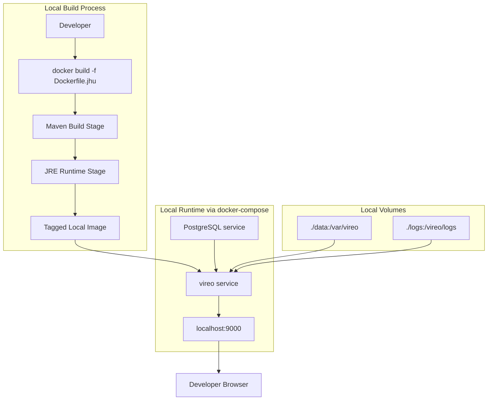
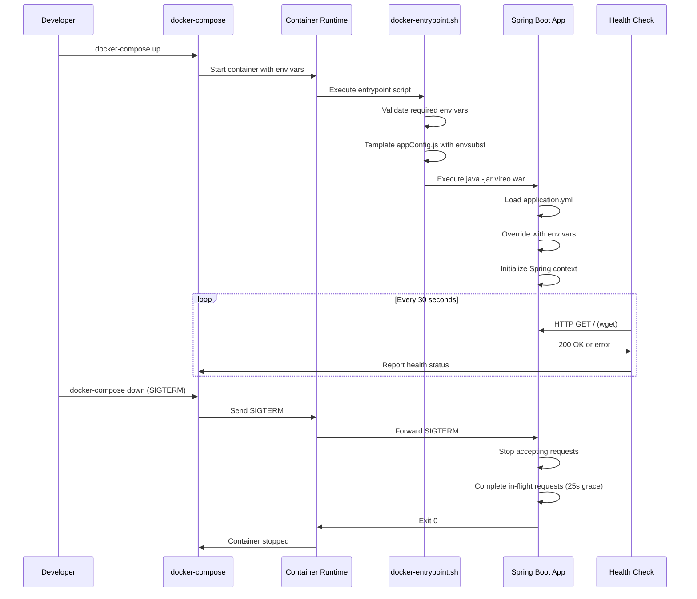

# Design Document: JHU Docker Image for Local Testing

## Overview

This design specifies the technical implementation for creating a Docker image of the Vireo ETD Management System configured for Johns Hopkins University (JHU) local development and testing. The image enables developers to build and run the full Vireo application stack locally using Docker and docker-compose, with support for both H2 and PostgreSQL databases. This image is intended solely for local testing and is not part of any CI/CD pipeline or production deployment infrastructure.

### Goals

- Create a JHU-specific Dockerfile (`Dockerfile.jhu`) for local containerized testing
- Enable configuration through environment variables for flexible local testing
- Implement container health checks for docker-compose service readiness
- Support local directory mounts for persistent data across container restarts
- Provide docker-compose configuration for one-command local stack startup
- Maintain compatibility with existing Spring Boot 2.x and Java 11 runtime
- Ensure security best practices (non-root user, no hardcoded secrets)

### Non-Goals

- Modifying the base Dockerfile (it remains for general local development)
- Changing the application's core configuration structure
- CI/CD pipeline integration or automated builds
- Container registry push workflows (GHCR, ECR)
- AWS service integration (ECS, Fargate, Secrets Manager, Parameter Store, CloudWatch)
- Production deployment infrastructure

## Architecture

### High-Level Architecture



### Container Lifecycle



### Local Testing Flow

1. **Build Stage**: `docker build -f Dockerfile.jhu` runs Maven with production profile, creates JRE image
2. **Tag Stage**: Image tagged locally (e.g., `vireo-jhu:local`)
3. **Run Stage**: `docker-compose up` starts Vireo + PostgreSQL
4. **Test Stage**: Developer accesses application at `http://localhost:9000`
5. **Shutdown Stage**: `docker-compose down` gracefully stops all services

## Components and Interfaces

### 1. Dockerfile.jhu

**Purpose**: JHU-specific multi-stage Dockerfile for local testing

**Structure**:
- **Maven Stage**: Builds application WAR with production profile
- **JRE Stage**: Creates minimal runtime image with Java 11 JRE

**Key Differences from Base Dockerfile**:
- Adds HEALTHCHECK instruction for docker-compose readiness detection
- Configures graceful shutdown timeout (30s)
- Optimizes layer caching for faster rebuilds
- Includes OCI image labels (version, commit SHA, build timestamp)

**Build Arguments**:
```dockerfile
ARG USER_ID=1000
ARG USER_NAME=vireo
ARG HOME_DIR=/vireo
ARG SOURCE_DIR=$HOME_DIR/source
ARG APP_PATH=/var/vireo
ARG NODE_ENV=production
```

**Health Check Configuration**:
```dockerfile
HEALTHCHECK --interval=30s --timeout=10s --start-period=60s --retries=3 \
  CMD wget --no-verbose --tries=1 --spider http://localhost:9000/ || exit 1
```

### 2. Enhanced docker-entrypoint.sh

**Purpose**: Initialize container environment and template configuration files

**Responsibilities**:
- Template `appConfig.js` using environment variables via `envsubst`
- Validate required environment variables are present
- Log output to STDOUT/STDERR for `docker-compose logs` visibility
- Warn (but don't fail) if optional Spring Boot override variables are missing

**Key Environment Variables Processed**:
- `AUTH_SERVICE_URL`: Authentication service endpoint
- `LOCAL_AUTHENTICATION`: Enable/disable local auth (true/false/'alternate')
- `STOMP_DEBUG`: WebSocket debugging flag (true/false)
- `APP_PATH`: Application data directory path

**Error Handling**:
- Exit with code 1 if required variables (AUTH_SERVICE_URL, LOCAL_AUTHENTICATION, STOMP_DEBUG, APP_PATH) are missing
- Log descriptive error messages to STDERR
- Validate template file exists before processing

### 3. Spring Boot Configuration Override

**Purpose**: Enable environment variable-based configuration for flexible local testing

**Configuration Hierarchy** (highest to lowest precedence):
1. Environment variables (from `.env` file or docker-compose)
2. External `application.yml` (mounted volume)
3. Packaged `application.yml` (WAR file)

**Key Environment Variable Mappings**:

| Environment Variable | Spring Property | Purpose |
|---------------------|-----------------|---------|
| `SPRING_DATASOURCE_URL` | `spring.datasource.url` | Database connection string |
| `SPRING_DATASOURCE_USERNAME` | `spring.datasource.username` | Database username |
| `SPRING_DATASOURCE_PASSWORD` | `spring.datasource.password` | Database password |
| `SPRING_JPA_DATABASE_PLATFORM` | `spring.jpa.database-platform` | Hibernate dialect |
| `AUTH_SECURITY_JWT_SECRET` | `auth.security.jwt.secret` | JWT signing key |
| `APP_SECURITY_SECRET` | `app.security.secret` | Crypto service key |
| `APP_EMAIL_HOST` | `app.email.host` | SMTP server |
| `APP_EMAIL_FROM` | `app.email.from` | Email sender address |
| `SERVER_PORT` | `server.port` | HTTP port (default 9000) |
| `LOGGING_LEVEL_ORG_TDL` | `logging.level.org.tdl` | Application log level |

**Spring Boot Auto-Configuration**:
Spring Boot automatically converts environment variables with underscores to property paths with dots and lowercase. For example:
- `SPRING_DATASOURCE_URL` → `spring.datasource.url`
- `AUTH_SECURITY_JWT_SECRET` → `auth.security.jwt.secret`

**Database Switching for Local Testing**:

H2 (in-memory, no external database needed):
```bash
SPRING_DATASOURCE_URL=jdbc:h2:mem:AZ;DB_CLOSE_DELAY=-1;DB_CLOSE_ON_EXIT=FALSE
SPRING_DATASOURCE_DRIVERCLASSNAME=org.h2.Driver
SPRING_JPA_DATABASE_PLATFORM=org.hibernate.dialect.H2Dialect
```

PostgreSQL (via docker-compose):
```bash
SPRING_DATASOURCE_URL=jdbc:postgresql://db:5432/vireo
SPRING_DATASOURCE_DRIVERCLASSNAME=org.postgresql.Driver
SPRING_JPA_DATABASE_PLATFORM=org.hibernate.dialect.PostgreSQLDialect
```

### 4. Local Image Tagging

**Purpose**: Simple tagging convention for locally built images

**Tagging Strategy**:
- `vireo-jhu:local` — default local development tag
- `vireo-jhu:test` — for test runs
- Developer-specified tags as needed

**Image Labels** (OCI standard):
```dockerfile
LABEL org.opencontainers.image.title="Vireo ETD Management System - JHU"
LABEL org.opencontainers.image.description="JHU-specific Docker image for local testing"
LABEL org.opencontainers.image.version="${VERSION}"
LABEL org.opencontainers.image.created="${BUILD_TIMESTAMP}"
LABEL org.opencontainers.image.revision="${VIREO_GIT_SHA_FULL}"
LABEL org.opencontainers.image.source="https://github.com/jhu-sheridan-libraries/vireo"
LABEL org.opencontainers.image.vendor="Johns Hopkins University"
```

**Example Build Command**:
```bash
docker build -f Dockerfile.jhu \
  --build-arg VERSION=4.3.2 \
  --build-arg VIREO_GIT_SHA_FULL=$(git rev-parse HEAD) \
  --build-arg VIREO_GIT_SHA_SHORT=$(git rev-parse --short=12 HEAD) \
  --build-arg BUILD_TIMESTAMP=$(date +%Y%m%d-%H%M%S) \
  -t vireo-jhu:local \
  .
```

### 5. docker-compose.yml

**Purpose**: One-command local stack for integration testing

**Services**:
- `vireo`: Application container built from Dockerfile.jhu
- `db`: PostgreSQL database with preconfigured test credentials

**Key Configuration**:
```yaml
services:
  vireo:
    build:
      context: .
      dockerfile: Dockerfile.jhu
    ports:
      - "9000:9000"
    depends_on:
      db:
        condition: service_healthy
    env_file: .env
    volumes:
      - vireo-data:/var/vireo
      - vireo-logs:/vireo/logs

  db:
    image: postgres:14
    environment:
      POSTGRES_DB: vireo
      POSTGRES_USER: vireo
      POSTGRES_PASSWORD: vireo
    healthcheck:
      test: ["CMD-SHELL", "pg_isready -U vireo"]
      interval: 10s
      timeout: 5s
      retries: 5
```

### 6. Volume Mount Strategy

**Purpose**: Persist application data across container restarts during local testing

**Local Directory Mounts**:
- `/var/vireo` — application data (uploaded files, templated appConfig.js)
- `/vireo/logs` — application logs

**Directory Structure**:
```
/var/vireo/
├── public/          # Public assets (uploaded files)
├── private/         # Private documents (submissions)
├── config/          # External configuration files (optional)
└── appConfig.js     # Templated frontend configuration
```

**Permissions**:
- Container runs as UID 1000 (non-root user `vireo`)
- Local mounted directories must be writable by UID 1000
- When volumes are not mounted, container-local directories are used as fallback

## Data Models

### Environment Configuration Model

The application configuration is represented as a hierarchical model with environment variable overrides:

```yaml
# Base Configuration (application.yml)
server:
  port: 9000

spring:
  datasource:
    url: jdbc:h2:mem:AZ;DB_CLOSE_DELAY=-1;DB_CLOSE_ON_EXIT=FALSE
    username: vireo
    password: vireo
  jpa:
    database-platform: org.hibernate.dialect.H2Dialect

auth:
  security:
    jwt:
      secret: verysecretsecret  # Overridden by env var
      issuer: localhost
      duration: 5

app:
  security:
    secret: verysecretsecret  # Overridden by env var
  assets:
    uri: file:/var/vireo/
  email:
    host: relay.tamu.edu
    from: noreply@library.tamu.edu
```

**Local Testing Override Example**:
```bash
# .env file for docker-compose local testing with PostgreSQL
SPRING_DATASOURCE_URL=jdbc:postgresql://db:5432/vireo
SPRING_DATASOURCE_USERNAME=vireo
SPRING_DATASOURCE_PASSWORD=vireo
SPRING_JPA_DATABASE_PLATFORM=org.hibernate.dialect.PostgreSQLDialect
AUTH_SECURITY_JWT_SECRET=local-dev-secret
APP_SECURITY_SECRET=local-dev-secret
APP_EMAIL_HOST=relay.tamu.edu
APP_EMAIL_FROM=noreply@library.tamu.edu
```

### Frontend Configuration Model

The `appConfig.js` file is templated at container startup:

```javascript
// Template: build/appConfig.js.template
var appConfig = {
    'version': '4.3.2',
    'allowAnonymous': true,
    'anonymousRole': 'ROLE_ANONYMOUS',
    'authService': ${AUTH_SERVICE_URL},  // Substituted by envsubst
    'webService': window.location.protocol + '//' + window.location.host + window.location.base,
    'storageType': 'session',
    'stompDebug': ${STOMP_DEBUG},  // Substituted by envsubst
    'localAuthentication': ${LOCAL_AUTHENTICATION},  // Substituted by envsubst
};
```

**Environment Variables for Templating**:
- `AUTH_SERVICE_URL`: JavaScript expression for auth service endpoint
- `STOMP_DEBUG`: Boolean for WebSocket debugging
- `LOCAL_AUTHENTICATION`: Boolean or string 'alternate' for auth mode

## Error Handling

### Build-Time Errors

**Dockerfile Syntax Errors**:
- **Detection**: Docker build fails with syntax error message
- **Recovery**: Developer fixes Dockerfile syntax and rebuilds

**Maven Build Failures**:
- **Detection**: Maven exits with non-zero status during Docker build
- **Handling**: Docker build fails at Maven stage, no image created
- **Recovery**: Developer fixes Java compilation or dependency issues, rebuilds
- **Common Causes**: Dependency resolution failures, compilation errors, resource processing errors

**NPM Build Failures**:
- **Detection**: NPM exits with non-zero status during Maven build
- **Handling**: Maven build fails, Docker build fails
- **Recovery**: Developer fixes frontend build issues
- **Common Causes**: Node version mismatch, missing node_modules, webpack configuration errors

### Runtime Errors

**Missing Required Environment Variables**:
- **Detection**: Entrypoint script logs error to STDERR, exits with code 1
- **Handling**: Container fails to start, visible in `docker-compose logs`
- **Recovery**: Add missing variables to `.env` file or docker-compose environment section
- **Example Error**: `"ERROR: Required environment variable AUTH_SERVICE_URL is not set"`

**Invalid Database Connection**:
- **Detection**: Spring Boot fails to establish database connection during startup
- **Handling**: Application logs connection error, container exits with non-zero status
- **Recovery**: Verify PostgreSQL container is running and healthy, check credentials in `.env`
- **Example Error**: `"Could not connect to database: Connection refused"`

**Health Check Failures**:
- **Detection**: Health check command returns non-zero exit code 3 consecutive times
- **Handling**: docker-compose marks container as unhealthy
- **Recovery**: Check `docker-compose logs vireo` for application errors
- **Common Causes**: Application deadlock, out of memory, database connection pool exhaustion

**Volume Mount Permission Errors**:
- **Detection**: Application fails to write to /var/vireo, logs permission denied error
- **Handling**: Container may start but fail to persist data
- **Recovery**: Ensure local mounted directory is writable by UID 1000 (`chmod 777 ./data` or `chown 1000 ./data`)
- **Example Error**: `"Permission denied: /var/vireo/public"`

**Graceful Shutdown Timeout**:
- **Detection**: Application doesn't exit within 30 seconds of SIGTERM
- **Handling**: Docker sends SIGKILL, forcefully terminates container
- **Recovery**: Investigate why shutdown is slow (long-running requests, database transactions)

### Configuration Errors

**Invalid Hibernate Dialect**:
- **Detection**: JPA initialization fails with unsupported dialect error
- **Handling**: Application fails to start, container exits
- **Recovery**: Set correct SPRING_JPA_DATABASE_PLATFORM for database type
- **Example**: Use `org.hibernate.dialect.PostgreSQLDialect` for PostgreSQL, `org.hibernate.dialect.H2Dialect` for H2

**Malformed appConfig.js Template**:
- **Detection**: envsubst fails during entrypoint execution
- **Handling**: Entrypoint script exits with error, container fails to start
- **Recovery**: Fix template syntax in build/appConfig.js.template, rebuild image
- **Example Error**: `"envsubst: syntax error in variable reference"`

## Testing Strategy

### Integration Testing

**Local Docker Testing**:
- Build image locally: `docker build -f Dockerfile.jhu -t vireo-jhu:test .`
- Run with PostgreSQL: `docker-compose up --build`
- Verify health check: `docker inspect --format='{{.State.Health.Status}}' <container>`
- Test volume mounts: Mount local directory and verify file persistence
- Test graceful shutdown: `docker-compose down` and verify clean exit
